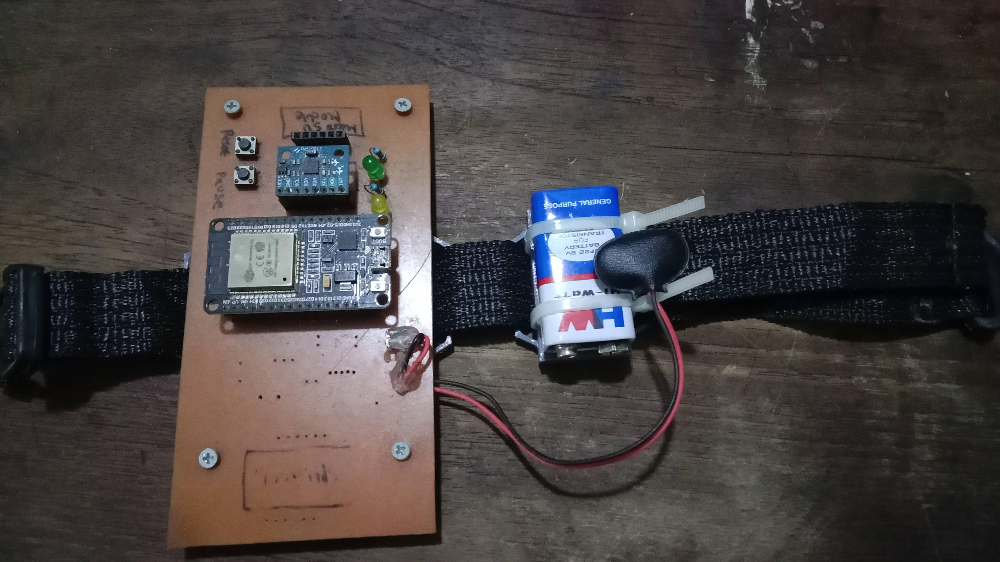

# Dhupee Fall Detection Thingy Thesis

<!--toc:start-->
- [Dhupee Fall Detection Thingy Thesis](#dhupee-fall-detection-thingy-thesis)
  - [Wait, Thesis?](#wait-thesis)
  - [But Why?](#but-why)
  - [What the project gonna looks like](#what-the-project-gonna-looks-like)
  - [Tools I use](#tools-i-use)
  - [Abstrak (ID)](#abstrak-id)
  - [Abstract (EN)](#abstract-en)
  - [File Structure](#file-structure)
  - [What I Intentionally left out](#what-i-intentionally-left-out)
<!--toc:end-->

## Wait, Thesis?

I decided to open up my undergrad thesis project just to expose what my research is, but without really share the paper since I'm not sure if it's okay, and my Journal isn't published just yet, not sure also if it will be.

My thesis involve few skills that I learned over the years which is Electronics, Embedded System Programming, Machine Learning, and 3D Designs/Printing.

My thesis itself is titled `Perangkat Wearable Untuk Deteksi Orang Jatuh Berbasis Edge Computing Dan Machine Learning` or `Edge Computing And Machine Learning Based Fall Detection Wearable Device` in english.

## But Why?

I believe my thesis is quite 'novel' among my peers in my Uni, especially during the rise of Computer Vision and LLM during that time, doing small is in my opinion a unique path, not only because the recent LLM advancement actually cause computing demand to the roof, and those melting GPU, bla bla bla, its nice to keep things small.

## What the project gonna looks like

## Tools I use

This thesis uses few tools i know, it actually squeeze my brain like sponge.

- Kicad to design PCB.
- PlatformIO as sort of IDE/Compiler for coding the firmware, with C++ as the code, and Arduino as the Platform
- Onshape to create the strap
- Neovim to edit the codes
- Tectonic to compile the LaTeX (YES I USE LATEX BITCH)
- Edge Impulse so i can easily train the model and convert it to Arduino library

## Abstrak (ID)

Penelitian mengenai deteksi jatuh sudah pernah dilakukan sebelumnya, salah satu penelitian yang dilakukan menggunakan Xbox Kinect dan metode *AdaBoost* dan *Thresholding* yang dimana Kinect yang digunakan memiliki area deteksi yang terbatas, penelitian lain menggunakan perangkat wearable yang dimana mengatasi permasalahan tersebut, akan tetapi metode *Detection Threshold* yang digunakan menghasilkan akurasi yang cukup rendah dan tidak memiliki metode untuk mengenali pola.

Penelitian ini dilakukan dengan merancang perangkat *wearable* lalu mengaplikasikan TinyML untuk memungkinkan mikrokontroler menggunakan Machine Learning secara langsung. Penelitian ini menggunakan ESP32 sebagai mikrokontroler dan juga MPU6050 sebagai sensor utamanya dengan Arduino sebagai framework untuk merancang firmware. Dataset yang digunakan merupakan dataset yang dikumpulkan secara pribadi. Model machine learning dirancang menggunakan Edge Impulse dan Tensorflow sebagai framework, model menggunakan Spectral Analysis dari Edge Impulse sebagai *Feature Extractor* dan juga *Artificial Neural Network* sebagai metode klasifikasi.

Dari hasil penelitian yang diperoleh, ESP32 dapat digunakan untuk memproses Machine Learning secara langsung, dengan akurasi sebesar 70.83\% ketika menggunakan dataset yang digunakan, dan ESP32 dapat memproses data dalam waktu 11ms, dan juga dapat digunakan untuk mengirimkan notifikasi ketika pengguna jatuh.

**Kata Kunci**: Machine Learning, Mikrokontroler, ESP32, TinyML, Tensorflow.

## Abstract (EN)

Research on fall detection has been conducted previously. One such study utilized the Xbox Kinect with the *AdaBoost* and *Thresholding* methods. However, the Kinect used in that study had a limited detection area. Another study employed wearable devices which resolved such issue, although the *Detection Threshold* method the study used resulted in relatively low accuracy and lacked the capability to recognize patterns.

This research involves designing a wearable device and implementing TinyML to enable microcontrollers to directly utilize Machine Learning. The study uses the ESP32 microcontroller and the MPU6050 as its primary sensor, with Arduino as the framework for developing the firmware. The dataset used was collected independently. The Machine Learning model was designed using Edge Impulse and TensorFlow as the frameworks. The model utilizes Spectral Analysis from Edge Impulse as the *Feature Extractor* and *Artificial Neural Networks (ANN)* as the classification method.

The results of the research show that the ESP32 can process Machine Learning directly, achieving an accuracy of 70.83\% with the dataset used. The ESP32 is capable of processing data in 11 milliseconds and can also send notifications when a fall is detected.

**Keywords**: Machine Learning, Microcontroller, ESP32, TinyML, TensorFlow.

## File Structure

Since this is a monorepo consist of few different seperate projects for this thesis, I will explain the directories started from the one i'm working on the first.

- `schematics` is the electronics, component footprints, etc. Fabricate yourself its just single layer PCB, I make sure that way.
- `data-gathering-firmware` is the first firmware, to gather the data, that will be stored to the Micro SD card.
- `printed-strap` is the...strap for the PCB, simple shit so I can wear it, 3D printed.
- `static-buffer-firmware` is the firmware to test the model once I get it trained, to make sure the ESP32 is able to infer the data.
- `inference-firmware` the actual shit.

## What I Intentionally left out

Pretty sure my lecturer will lecture me ~get it~ if i share the whole thing, so there are few things i left out.

- the dataset i create
- the model
- the thesis draft LOL
